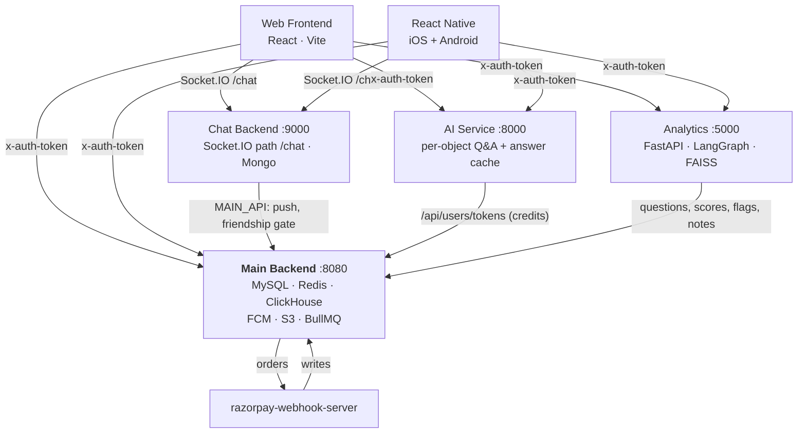

# Spaced Revision — Repo Documentation

In-depth working documentation for the six repos that make up the core Spaced Revision platform. Generated from full source inspection (July–August 2026). Each note is a standalone deep-dive; this page is the map.

## Notes in this folder

| Repo | Stack | Deep-dive note |
|------|-------|----------------|
| — | system view: who calls whom, identity, data ownership | **[[Cross-Service Architecture]]** |
| `spaced-revision-sern-backend` | Node.js/Express (CommonJS), MySQL 8, Redis, ClickHouse, BullMQ | [[Backend - Main REST API]] |
| `spaced-revision-sern-frontend` | React 18 / Vite 7, Redux (classic thunks), Tailwind + DaisyUI, MUI 5 | [[Web Frontend - React]] |
| `react-native-app` | React Native 0.79 / React 19, TypeScript, Redux Toolkit, WatermelonDB | [[React Native App]] |
| `spaced-revision-chat-backend` | Node.js/Express (ESM), Socket.IO 4, MongoDB (Mongoose 8) | [[Chat Backend]] |
| `AI/` | Node.js/Express (ESM), MongoDB Atlas vector search, OpenAI/Gemini/Grok | [[AI Service - Content Generation]] |
| `analytics/` | Python/FastAPI, LangGraph, FAISS, pgvector, MongoDB | [[Analytics - AI Evaluation and Chat]] |

> Not documented here: `razorpay-webhook-server` (has its own authoritative `CLAUDE.md` + `docs/`), `transcoder`, `Spaced-Revision-Local-LLM`.

## System data flow

- Both clients authenticate to the **main backend** with a JWT in the **`x-auth-token`** header, and forward that same token to the AI services — which delegate verification upstream rather than validating locally.
- **Chat** is a separate Socket.IO service on a **non-default path `/chat`** (clients must set `{ path: '/chat' }`). Its socket auth is **trust-based** — a known gap.
- **Push is centralised**: only the main backend holds FCM credentials; other services fire-and-forget requests to it.
- **Credits/tokens live in MySQL only.** Both AI services read and write the balance over HTTP so there is exactly one authoritative counter.
- There is **no API gateway** — clients fan out to four backends directly, so CORS and TLS are per-service concerns.

## Ports (dev)

| Service | Port | Path notes |
|---------|------|-----------|
| Main backend | 8080 | REST `/api`, `/metrics`, `/health`, `/api-docs`, `/admin/queues` |
| Web frontend | 3000 | Vite dev, `--host` + ngrok hosts allowed |
| Chat backend | 9000 | Socket.IO path **`/chat`** (not `/socket.io`); `/iap` namespace |
| AI service | 8000 | REST `/api/response/*`, `/api/models`, `/api/admin/spacey-responses` |
| Analytics | 5000 | ⚠️ collides with macOS AirPlay — use `PORT=5001`. `/docs`, `/redoc`, `/health` |
| RN Metro | 8081 | `npm start --reset-cache` |

## Cross-cutting facts worth remembering

- **Package manager drift:** both the web frontend and the RN app have migrated to **pnpm** (with `--frozen-lockfile` CI), even though Volta/CLAUDE.md still mention Yarn. Install with pnpm.
- **Auth model:** main backend = real JWT (365-day app tokens, `x-auth-token`). Chat backend = **trust-based** socket auth (client asserts `id`/`username`/`is_admin`, no token check) — a known security gap. Analytics shares `JWT_SECRET` with the Node backend and can mint its own tokens.
- **Two AI services, split by interaction shape, not technology.** `AI/` = one object, one answer, cache-first. `analytics/` = conversations, streaming, tools, batch jobs.
- **Two vector stores inside `analytics/`** — FAISS (notes RAG) and pgvector (MCQ practice grouping). "The vector DB" is ambiguous; always clarify.
- **Service hosts are hardcoded in checked-in config**, not env vars — `ecosystem.config.js` (web) and `src/shared/utils/constants.ts` (RN). The web file's production branch currently points `address` at `localhost:8080`.
- **The `sevices/` (misspelled) directory in the backend is real and load-bearing** — do not "fix" the spelling. Same for `routes/Pratice/` in analytics and `insrtuctor.controller.js` in `AI/`.
- **WatermelonDB (SQLite)** is the RN app's offline store; course catalogs no longer live in redux-persist.
- **Brand teal `#1F4445` / `#2F6767`** is only in hand-written CSS on web — the DaisyUI `primary` token is actually blue `#033A84`.
- **Satellite stores reference MySQL by bare integer id with no FK.** Deleted/soft-deleted rows leave orphans in Mongo, FAISS, pgvector and the device cache — a recurring bug class.

> Related task board: [[Things to do]] · these notes complement each repo's in-tree `CLAUDE.md` + `docs/`.
