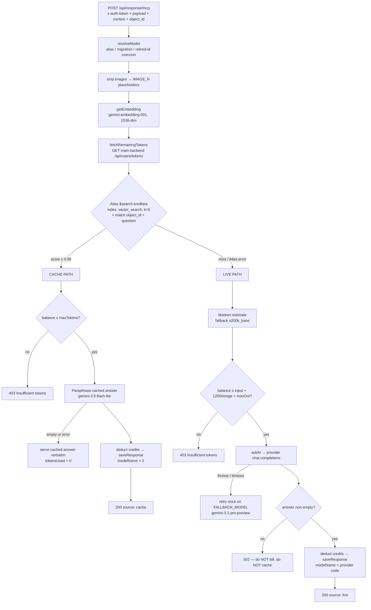
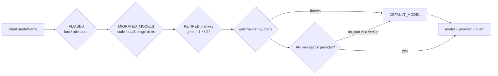

> Part of [[00 - Repo Documentation Overview]] · sibling AI service: [[Analytics - AI Evaluation and Chat]]

# Spaced Revision — AI Service (`AI/`)

The **per-object AI explainer**. When a learner taps "Ask AI" on a single MCQ, flashcard or note, this service answers it. It is deliberately narrow: one question, one object, one answer — plus a semantic answer cache so the same question asked by 500 students only pays for one LLM call.

> Repo root: `/Users/stardust/Code/AI`
> ~2.4k LOC under `src/`. **No tests, no lint, no build.** `npm run dev` → `nodemon src/app.js`.

---

## 1. Overview

| Fact | Detail |
|------|--------|
| Language / modules | Node.js, **ESM** (`"type": "module"`) |
| Framework | Express 5 + `express-async-handler` |
| Port | **8000** (`process.env.PORT \|\| 8000`) |
| Primary datastore | **MongoDB Atlas** (Mongoose 8) — collection `responses` |
| Secondary datastore | MySQL pool (`mysql2/promise`) — declared, largely vestigial |
| LLM providers | **OpenAI, Google Gemini, xAI (Grok)** — all through the OpenAI SDK |
| Auth | **None of its own.** Forwards the caller's `x-auth-token` to the main backend |
| Deploy | Docker (`compose.yaml`) or PM2 (`ecosystem.config.cjs`) |

### Why it exists separately from `analytics/`

Two AI services is a common interview question about this codebase. The split is by **interaction shape**, not by technology:

| | `AI/` (this repo) | `analytics/` |
|---|---|---|
| Unit of work | One object (MCQ / flashcard / note) | A conversation, an essay, a batch job |
| Response | Single JSON blob | **Streaming NDJSON**, tool calls, structured artifacts |
| Memory | Last-N conversation lookup by `object_id` | Threads persisted in Mongo, thread names, history |
| Retrieval | **Answer cache** (embed the question, reuse the answer) | **Content RAG** (FAISS over 20K notes) |
| Language | Node/Express | Python/FastAPI + LangGraph |

`AI/` is a *cache-first Q&A microservice*. `analytics/` is an *agent platform*.

---

## 2. Request flow — `POST /api/response/*`

The single most important code path in the repo (`src/controllers/ask.controller.js`, 379 lines). Three routes share one controller — `/response/mcq`, `/response/notes`, `/response/flashcard` — and the shape is inferred from `context.type` in the body, not the URL.



### Design decisions worth being able to defend

1. **The cache is an optimisation, never a dependency.** The `$search` aggregation is wrapped in try/catch and falls through to the live LLM on *any* error. Atlas rejects a query whose vector length doesn't match the index mapping, so an embedding-dimension change must degrade — not 500.
2. **Cache hits still cost credits.** A hit is paraphrased by a cheap model rather than served verbatim, so two students never see byte-identical text. If the paraphrase fails *or returns empty*, the raw cached answer is served with `tokensUsed: 0`.
3. **Empty answers are never billed or cached.** Thinking models can burn the whole completion budget and return `finish_reason: 'length'` with no content. Persisting that with a valid embedding would poison the cache for that question forever. Hence the explicit `!answer?.trim()` → 502 guard before any credit deduction or write.
4. **Writes never discard a paid-for answer.** Both `setRemainingTokens` and `saveResponse` are try/catch-and-log, not fail-the-request. The user already paid; losing the answer to a Mongo blip is the worse failure.
5. **Pre-flight gate uses an estimate, billing uses truth.** `tiktoken` estimates input tokens for the credit gate (falling back to `o200k_base` for ids it doesn't know, i.e. every Gemini and Grok model). Actual billing comes from `usage` on the provider response.

### Token/credit accounting

`usedTokens = ceil(prompt_tokens / 4) + completion_tokens`

Prompt tokens are discounted **4×** — the platform sells "conversation credits", and charging full price for a long MCQ stem the user didn't write would feel punitive. Images add a flat `IMAGE_TOKEN_OVERHEAD` (1200 each) to the pre-flight requirement only.

Balance lives in **MySQL, owned by the main backend**. This service holds no balance state — it does `GET`/`POST /api/users/tokens` with the caller's own token, which doubles as authentication: a bad token yields a 401/403 from upstream and the request dies before any LLM spend.

---

## 3. Model routing (`src/config/aiModels.js`)

Single source of truth for which models exist and which SDK client serves them. Provider is derived **by name prefix**, mirroring the analytics service's `get_model()`:

```
grok-*                     → xai     (OpenAI SDK @ https://api.x.ai/v1)
gemini-* | models/gemini-* → gemini  (OpenAI SDK @ generativelanguage.googleapis.com/v1beta/openai/)
gpt-* | o1-* | o3-* | o4-* → openai
```

All three providers speak the OpenAI wire format, so one SDK with three `baseURL`s covers everything — no per-provider dependency.



Layers of coercion, in order — each exists for a real production reason:

| Layer | Why |
|-------|-----|
| `ALIASES` (`fast`, `advanced`) | Old web/mobile builds still send these labels. `advanced` stays pinned to `gpt-4o` because both clients hardcode a `PREMIUM_MODELS` list containing `gpt-4o` — repointing it would silently un-gate premium billing. |
| `MIGRATED_MODELS` | Clients cache the user's model pick in localStorage/AsyncStorage **forever**. Anyone handed a previous default would stay on it indefinitely without a rewrite map. |
| `RETIRED_MODEL_PREFIXES` | `gemini-1.*` / `2.*` are still listed by `GET /v1beta/openai/models` but 404 on call ("no longer available to new users"). Rewriting them avoids a doomed round-trip *plus* an expensive fallback retry on every request. |
| keyless-provider check | A configured-but-keyless provider 401s on every call. Guarded by `id !== DEFAULT_MODEL` so a missing key for the *default* provider fails loudly instead of looping — a silent cross-provider swap is far harder to debug than a 401. |

Other registry facts:
- `DEFAULT_MODEL = gemini-3.5-flash`. Production **does not** pass `DEFAULT_AI_MODEL` through the deploy workflow, so the hardcoded fallback is what actually ships.
- `EMBEDDING_MODEL = gemini-embedding-001` at **1536 dimensions** (its native output is 3072) — chosen so the existing Atlas `vector_search` index mapping stays valid. Changing the dimension *requires* recreating that index.
- `GEMINI_REASONING_EFFORT = 'low'`. `'none'` is rejected by every `gemini-3.x` model with HTTP 400 — `low` is the floor.
- `FALLBACK_MODEL = gemini-3.1-pro-preview`, deliberately **not** in the registry: it's a safety net, not a user-selectable option. Pro-tier Gemini models are also kept out of the picker because the clients' `PREMIUM_MODELS` list knows no Gemini id — one would bill at 1 credit while costing like premium. Pro is also the main risk to the RN app's hard 60s timeout.
- `CAP_PARAM`: OpenAI reasoning models need `max_completion_tokens`; the xAI and Gemini compat layers use classic `max_tokens`.

### Vision auto-switch

If the question HTML/Markdown contains images, `aiService.askAI` silently swaps to `VISION_MODEL` (`gpt-4o-mini`), inlines the image URLs as `image_url` content parts at `detail: 'low'`, and replaces the markup with `[[IMAGE_N]]` placeholders in the text. Native Gemini vision is a TODO — it needs images downloaded and base64-inlined rather than passed by URL.

---

## 4. Data model — `responses` (MongoDB)

```js
{
  modelName: Number,   // legacy provider code, enum [0,1,2,3]
                       // 0=xai 1=openai 2=cache-paraphrase-marker 3=gemini
  modelId: String,     // exact id, e.g. 'gemini-3.5-flash' — prefer this
  tokensUsed: Number,
  question: String,    // the user's query (payload.userQuery)
  embedding: [Number], // 1536-dim, indexed by Atlas 'vector_search'
  answer: String,
  userId: Number,      // MySQL user id — cross-store reference, no FK
  context: { type: { type: String, enum: ['mcq','notes','flashcard'] } },
  object_id: Number,   // MySQL mcq.id / card.id / notes.id
  source: String,      // default 'chatgpt'
  educatorReviewed, educatorCorrect, educatorEditedAnswer, reviewedAt, reviewedBy
}
// index: { object_id: 1, 'context.type': 1 }   + Atlas Search index 'vector_search'
```

Two things this schema encodes:

- **The nested `context.type` shape is a footgun.** `context` is an object whose only field is itself named `type`, so Mongoose needs the doubled `type:` nesting. Queries must use the dotted `'context.type'` path.
- **Educator review is a first-class loop.** `educatorEditedAnswer` takes precedence over `answer` on a cache hit, so an educator correcting one AI answer retroactively fixes it for every future student who asks that question. That's the `spaceyAdmin` surface (`/api/admin/spacey-responses`, 334-line service): filter, list, inspect and edit stored AI answers.

---

## 5. Endpoint map

| Method | Path | Purpose |
|--------|------|---------|
| POST | `/api/response/mcq` · `/notes` · `/flashcard` | Main ask flow (shared controller, branches on `context.type`) |
| GET | `/api/conversation` | Last-N turns for `userId` + `object_id` + `contextType` |
| POST | `/api/instructor` · `/api/explanation` | "Instructor" mode — returns **structured JSON**: explanation plus re-randomized options (`insrtuctor.controller.js`, spelling is load-bearing) |
| POST | `/api/doubt` | Free-form doubt on an object |
| GET | `/api/models` | Registry annotated with per-provider `available` (key present). Clients filter on it |
| GET | `/api/users/tokens` (proxy) | Read-through to main backend balance |
| GET/PATCH | `/api/admin/spacey-responses[/:id]` | Educator review console |

`AskInstructorAi` extracts a JSON object from the model's prose with a `/\{[\s\S]*\}/` regex before parsing — models don't reliably honour "JSON only", and this is the pragmatic guard.

---

## 6. Failure modes to know

| Symptom | Cause |
|---------|-------|
| Every request 401/403 | Bad or expired `x-auth-token` — upstream token fetch rejects before any LLM spend |
| Cache never hits | Embedding dimension drift vs the Atlas `vector_search` index mapping; the aggregation throws and is swallowed |
| Blank answer bubbles | Thinking model exhausted the budget → 502 by design; check `finish_reason` in logs |
| Credits drain unexpectedly fast | Vision path — 1200-token overhead per image on the pre-flight gate |
| Wrong model used | Stale client preference rewritten by `MIGRATED_MODELS`, or a keyless provider coerced to default. Both log a `[aiModels]` warning |

---

## 7. Environment

```
PORT=8000
MONGO_URI=...                        # Atlas, needs 'vector_search' index on responses.embedding
SPACED_BACKEND_BASE_URL=http://localhost:8080
OPENAI_API_KEY= / GEMINI_API_KEY= / XAI_API_KEY=
DEFAULT_AI_MODEL=  EMBEDDING_MODEL=  EMBEDDING_DIMENSIONS=1536
FALLBACK_MODEL=  PARAPHRASE_MODEL=  VISION_MODEL=  VISION_IMAGE_DETAIL=low
IMAGE_TOKEN_OVERHEAD=1200  GEMINI_REASONING_EFFORT=low
MYSQL_HOST= MYSQL_USER= MYSQL_PASSWORD= MYSQL_DB_NAME= MYSQL_DB_NAME_PORT=
```

> ⚠️ `MYSQL_DB_NAME_PORT` is parsed as the **port** (`parseInt(process.env.MYSQL_DB_NAME_PORT, 10)`) despite the name. The MySQL pool logs its connection result at import time and is otherwise near-unused — balance flows through HTTP, not SQL.
