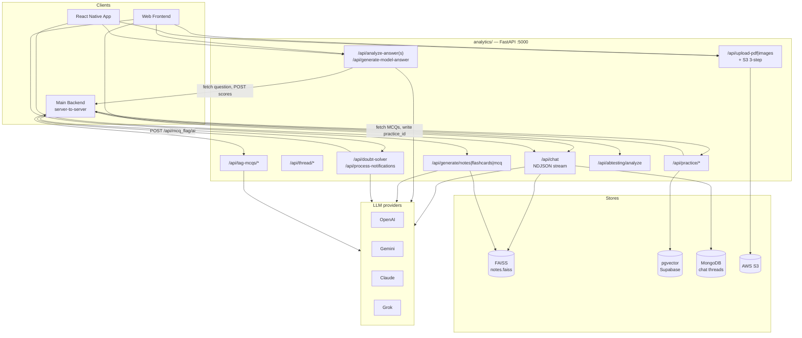
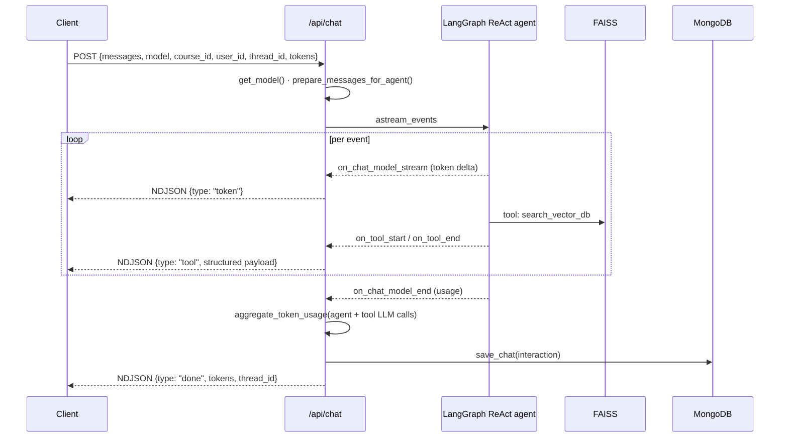
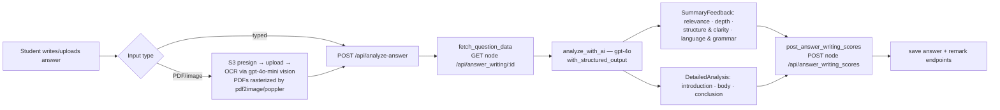
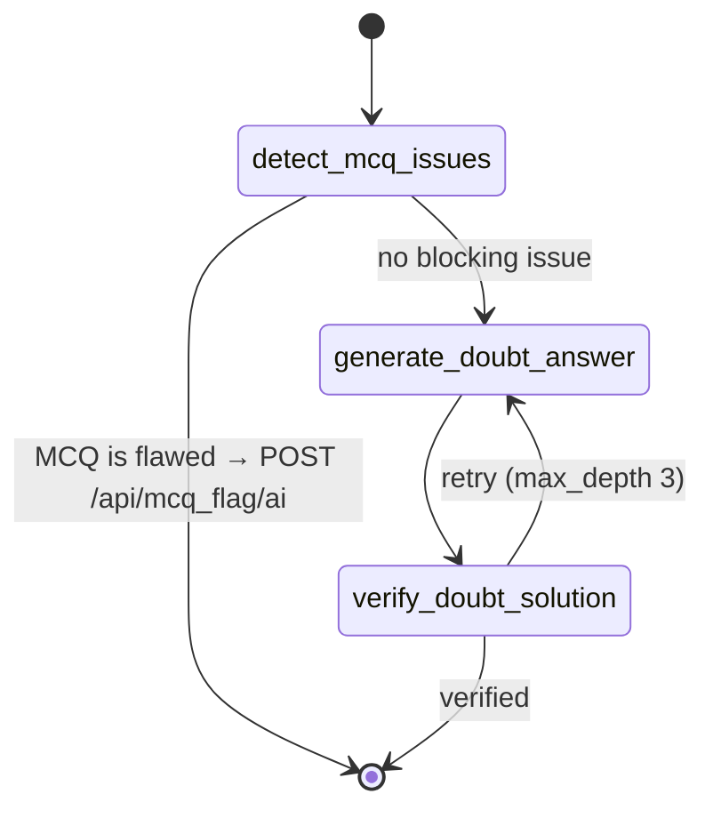

> Part of [[00 - Repo Documentation Overview]] · sibling AI service: [[AI Service - Content Generation]]

# Spaced Revision — Analytics Service (`analytics/`)

The **AI platform** of the product. Despite the name it does almost no product analytics — it is the Python/FastAPI service that runs the agentic chat ("SpaceyAI"), grades handwritten essay answers, generates study material from a RAG index over 20K+ notes, OCRs PDFs and images, auto-tags MCQs, and clusters MCQs into practice groups.

> Repo root: `/Users/stardust/Code/analytics`
> ~12.6k LOC of Python. `pytest` configured with markers (`unit`, `integration`, `auth`, `routes`, `services`, `slow`), asyncio auto mode.

```bash
uvicorn app:app --host 0.0.0.0 --port 5001 --reload    # dev
python app.py                                          # prod
```

> ⚠️ Default port is **5000, which macOS AirPlay Receiver squats**. If the server "exits right after `Services initialized successfully`", set `PORT=5001`.

---

## 1. Overview

| Fact | Detail |
|------|--------|
| Framework | FastAPI, fully async, Uvicorn (`timeout_keep_alive=300`) |
| Orchestration | **LangGraph** (ReAct agent + a hand-built doubt-solver state graph) |
| LLM providers | OpenAI · Google Gemini · **Anthropic Claude** · xAI Grok, via LangChain chat models |
| Retrieval #1 | **FAISS** — `vectorDB/notes.faiss`, sentence-transformers `all-MiniLM-L6-v2` (384-dim) |
| Retrieval #2 | **pgvector / Supabase** — MCQ embeddings for practice grouping only |
| Persistence | MongoDB (chat history + threads), optional |
| Tracing | **LangSmith** — configured in `config.settings` *before any model is imported* |
| Auth | JWT (`HS256`, shared `JWT_SECRET` with the Node backend), plus header pass-through |

### Graceful degradation is the architectural theme

`lifespan` connects MongoDB and the vector DB, and **neither can take down startup**:

- `mongo_service.connect()` self-disables if `ENABLE_MONGODB=false`, `MONGO_URI` is unset, or the server is unreachable — it never raises. Every method then guards on `if self.chat_collection is None`.
- The vector DB warm-up is wrapped in try/except and only runs when `ENABLE_VECTOR_DB` **and** `VECTOR_DB_URL` are set. Failure logs a warning and turns MCQ grouping off.
- The whole `lifespan` body is itself wrapped: *"Never let optional-service setup take down the server."*

Consequence for anyone reading this code: **do not assume Mongo or pgvector are live.** Chat works without Mongo (you just lose history); practice grouping silently disappears without pgvector.

### The two vector stores — the single most confusable thing here

| | FAISS | pgvector / Supabase |
|---|---|---|
| File / location | `vectorDB/notes.faiss` + `notes_meta.json` | Postgres, `VECTOR_DB_URL` |
| Embedding model | `all-MiniLM-L6-v2`, 384-dim, local | generated per-MCQ in `PracticeGroupingService` |
| Contents | 25K+ chunks from 20K+ course notes | MCQ vectors + `practice_id`/`topic_id`/`course_id` |
| Used by | agent `search_vector_db` tool, all content generation | `/api/practice/*` grouping endpoints only |
| Built by | `helper/vectorize_notes.py` from Node `/api/notes/notescontent` | `/api/practice/vectorize[-all]` |
| Similarity | cosine via `IndexFlatIP` on L2-normalized vectors | cosine, `SIMILARITY_THRESHOLD` default 0.5 |

"The vector DB" is ambiguous in this repo — always clarify which.

---

## 2. Service map



---

## 3. Agentic chat — `POST /api/chat`

The flagship feature. A LangGraph **ReAct agent** ("SpaceyAI") with 5 tools, streamed to the client as NDJSON.

### Model router (`routes/chat/chat.py::get_model`)

By name prefix, same idea as the `AI/` service but returning **LangChain** models:

```
"default"  → grok-4-fast          (the actual production default)
gpt-* o3-* → ChatOpenAI
gemini-*   → ChatGoogleGenerativeAI
claude-*   → ChatAnthropic
grok-*     → ChatXAI
otherwise  → ValueError
```

Note the asymmetry with the rest of the service: the *chat* default is `grok-4-fast` (cheap, fast), while **answer-writing evaluation and all content generation are pinned to `gpt-4o`** — those are correctness-critical and use structured output, so the model is not user-selectable there. MCQ tagging uses `gpt-5-nano`; OCR uses `VISION_MODEL` (`gpt-4o-mini`).

### The 5 tools (`services/agent/agent_tools.py`)

| Tool | Does |
|------|------|
| `search_vector_db(query, course_name?, subject_name?, topic_id?, topic_name?, k=10)` | FAISS search over notes. When any filter is passed it over-fetches `k*3` then filters in Python — the index has no metadata filtering |
| `create_flashcards` | 1–10 cards, front/back + difficulty |
| `create_mcqs` | 1–10 MCQs with options + explanation + difficulty band |
| `create_notes` | Structured multi-section notes |
| `get_course_structure(course_name?, subject_name?)` | Hierarchical course→subject→topic listing, module-level cached |

### Two prompt constraints that are pure anti-hallucination engineering

1. **`get_course_structure` must be called before naming any course/subject/topic.** The prompt says so four separate times in escalating capitals. Without it the model confidently invents plausible course names ("US Exam 2025-26") that don't exist, and then filters generation by them, yielding empty results with no visible error.
2. **The agent must not restate generated content.** Flashcards/MCQs/notes are emitted as **structured tool output**, deduplicated server-side and rendered by dedicated client components (`FlashcardView`, `MCQView`, `NotesView` in RN; equivalents on web). If the model also wrote them into the prose, the user would see everything twice.

Also enforced in the prompt: the three generators are mutually exclusive per turn, and the hard cap is 10 items (backed by `MAX_FLASHCARDS_IN_CHAT=20` / `MAX_MCQ_IN_CHAT=15` in settings).

### Streaming



`aggregate_token_usage` is worth calling out: tools make their **own** LLM calls (generation runs `gpt-4o` inside the tool), so agent-level usage alone under-bills by a wide margin. Usage from the agent and from every tool call is summed before syncing the balance.

### Token sync

`services/chat/token_service.py` posts the aggregate back to the Node backend at `/api/users/tokens`. `_extract_tokens_value` defensively handles several response shapes because the Node handler does `res.json(tokens)` on a raw SQL result — sometimes a number, sometimes an object, sometimes an array of rows.

Content-generation endpoints gate on `MIN_TOKENS_REQUIRED = 750` (one "conversation credit"). `adjust_generation_limit` has a neat rule: a user sitting at *exactly* 750 gets **1** item regardless of what they asked for — enough to feel the feature, not enough to go negative.

### Threads (`routes/chat/threads.py`)

Chat history is a flat Mongo collection keyed by `user_id` + `course_id` + `thread_id`; "threads" are a Mongo aggregation over it, not a separate collection.

| Method | Path |
|--------|------|
| GET | `/api/threads/{course_id}/{user_id}` — list with names |
| GET | `/api/thread/latest/{course_id}/{user_id}` |
| POST | `/api/thread/create/{course_id}/{user_id}` |
| PUT | `/api/thread/{course_id}/{user_id}/{thread_id}` — rename |
| DELETE | `/api/thread/{course_id}/{user_id}/{thread_id}` — `delete_many`, no soft delete |
| GET | `/api/chat/{course_id}/{user_id}` — full history |

`thread_name_service.py` auto-names a thread from its first turn.

---

## 4. Answer-writing evaluation

The oldest feature — the service's `title` is still "Answer Writing Analysis Service".



Key points:

- **Pydantic schemas are generated at runtime.** `create_dynamic_analysis_models(max_score)` builds the response models per request so score bounds are baked into the schema the LLM must satisfy — the model can't return 12/10.
- **Educator prompts are injectable.** An `educators_prompt` on the question steers grading criteria per question, and the summary text changes to acknowledge it.
- **Token usage has a four-level fallback** (`usage_metadata` → `response_metadata` → SDK usage object → `len(content)//4` estimate). LangChain reports usage inconsistently across providers.
- **Bulk mode** (`/api/analyze-answers-bulk`) fans out under `MAX_CONCURRENT_REQUESTS=20` — the source of the "5–17× faster bulk processing" claim in the module docstring.

`services/answer_writing/api_service.py` is a thin, well-factored client for the five Node endpoints this flow touches (fetch question, post score, update score, save answer, post remark) — every call forwards the caller's `auth_token`.

---

## 5. Other feature areas

### Content generation — `POST /api/generate/{notes,flashcards,mcq}`
Non-agentic RAG: `retrieve_relevant_notes` (FAISS) → `format_notes_context` → `gpt-4o` with structured output → `validate_flashcard` / `validate_mcq` before returning. Same generators the chat tools call, exposed directly for the "generate from this topic" buttons.

### PDF / image ingest — `routes/pdf/pdf_routes.py`
Two paths. Direct upload (`/api/upload-pdf`, `/api/upload-images`, 16 MB cap) and a **3-step S3 flow** for large files: `POST /upload-pdf/init` returns a presigned URL → client uploads straight to S3 → `POST /upload-pdf/confirm` processes it server-side. Answer-writing has its own pair (`/aw-upload-url`, `/aw-extract`). PDFs are rasterized with `pdf2image` (needs **poppler**, `POPPLER_PATH`) then OCR'd page-by-page with the vision model.

### Doubt solver — `services/notification/doubt_services.py`
A hand-built **LangGraph state machine**, not a ReAct agent:



The first node is the interesting one: before answering a doubt about an MCQ, it checks whether the *MCQ itself* is broken (no correct option, multiple correct, ambiguous stem). If so it files an automated flag against the main backend instead of hallucinating a defence of a bad question. `/api/process-notifications` is the batch driver.

### MCQ auto-tagging — `routes/mcq_tagging.py`
`gpt-5-nano` assigns `subject_tag_id` then `topic_tag_id` from fixed taxonomies in `utils/subject_tag.json` / `topic_tag.json`. Two-stage by design: topic candidates are **filtered to the chosen subject** before the second prompt, which shrinks the option list and makes the second call both cheaper and far more accurate. Endpoints: `/tag-mcqs/by-subject`, `/tag-mcqs/by-topic`, `/tag-mcq/auto`.

### Practice grouping — `routes/Pratice/group_by_pratice.py` (dir misspelled, load-bearing)
Embeds MCQs into pgvector, then clusters by cosine similarity into practice sets of `PRACTICE_GROUP_SIZE=3` (min 2), threshold 0.5. Group-by-`similarity`/`topic`/`subject` variants, plus `/practice/similar/{mcq_id}` and `/practice/stats`. Results are written back through `NodeAPIClient.batch_update_practice_ids` → `PUT /api/mcq/practice/:mcq_id/:practice_id`.

### A/B testing — `POST /api/abtesting/analyze`
Statistical analysis over experiment data (`services/abtesting/analysis.py`), with a CLI driver at `analysis/ab_test_cli.py`.

---

## 6. Auth & cross-service contract

- `auth/jwt_handler.py` mints `HS256` tokens with `{service: 'answer_writing_analysis', id: user_id, iat, exp: +1h}` signed with the **same `JWT_SECRET` as the Node backend** — so the `id` field lands exactly where Express's `req.user.id` destructuring expects it. That shared secret is the trust boundary between the two services.
- Inbound client calls forward `x-auth-token` / `x-user-id` (both are in the CORS `allow_headers`), and the service passes them through to Node rather than re-deriving identity.
- CORS origins are a **hardcoded list** in `app.py` (localhost:3000/8080, spacedrevision.com + www/aws/dev subdomains) — a new frontend host means a code change.

## 7. Observability

- Every request logged in/out with duration via an HTTP middleware; 404, validation and unhandled-exception handlers all return the platform's `{statusCode, success, message}` envelope, with full tracebacks logged on 500.
- **LangSmith tracing** is set up in `config/settings.py` at import time — before any model is constructed, which is the only point where it takes effect. Project `analytics-ai-service`.

## 8. Environment

```
PORT=5001                      # 5000 collides with macOS AirPlay
JWT_SECRET=                    # MUST match the Node backend
OPENAI_API_KEY= GOOGLE_API_KEY= ANTHROPIC_API_KEY= XAI_API_KEY=
LANGCHAIN_API_KEY= LANGCHAIN_PROJECT=analytics-ai-service LANGCHAIN_TRACING_V2=true
MONGO_URI= MONGO_DB_NAME=analytics_chat CHAT_COLLECTION_NAME=chat ENABLE_MONGODB=true
VECTOR_DB_URL= ENABLE_VECTOR_DB=true      # Supabase/pgvector, MCQ grouping only
NODE_BASE_URL=http://localhost:8080  PROD_ENV=http://localhost:8080   # both used as the Node base
AWS_S3_BUCKET_NAME= AWS_REGION=ap-south-1 PRESIGNED_EXPIRATION=3600
POPPLER_PATH=/usr/bin  VISION_MODEL=gpt-4o-mini
MAX_CONCURRENT_REQUESTS=20  REQUEST_TIMEOUT=30
AGENT_MAX_ITERATIONS=5  AGENT_TIMEOUT=120  ENABLE_VECTOR_SEARCH_TOOL=true
PRACTICE_GROUP_SIZE=3  MIN_PRACTICE_GROUP_SIZE=2  SIMILARITY_THRESHOLD=0.5
```

> Two settings name the same thing: `API_BASE_URL` reads `PROD_ENV`, while `NODE_BASE_URL` reads `NODE_BASE_URL`. Different modules use different ones — set both.
