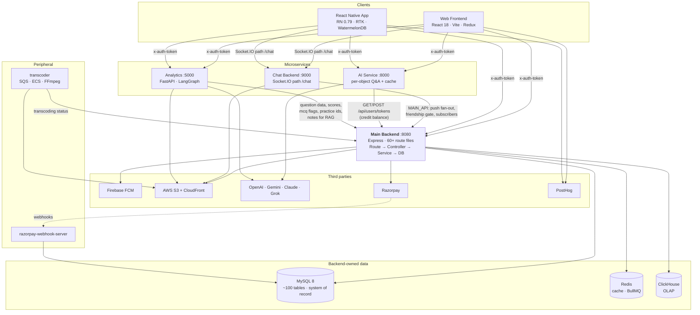
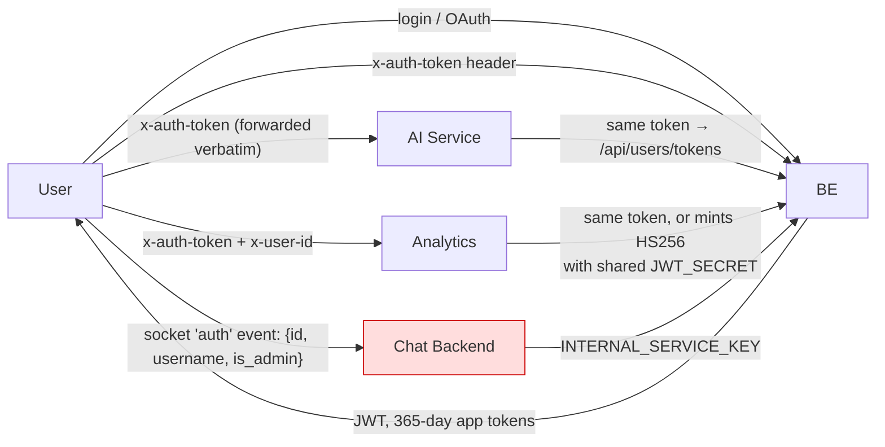
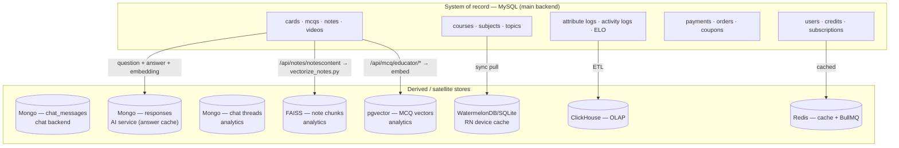
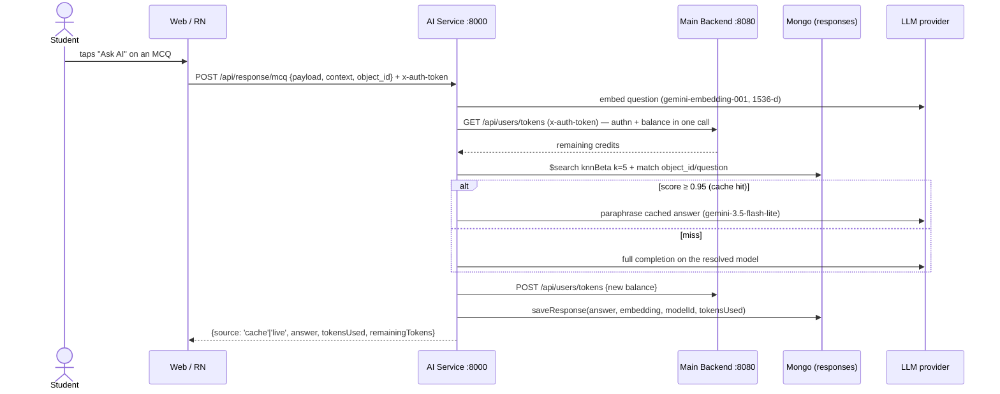
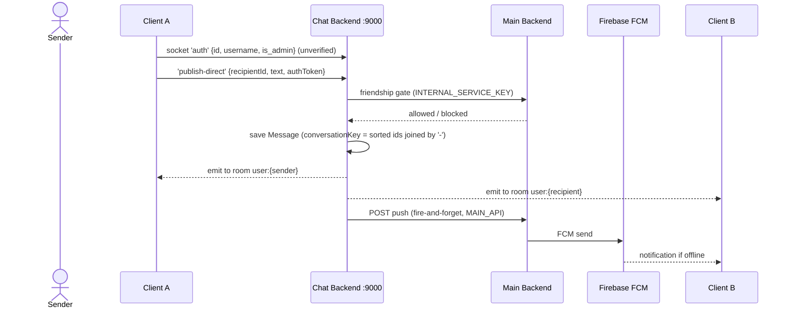
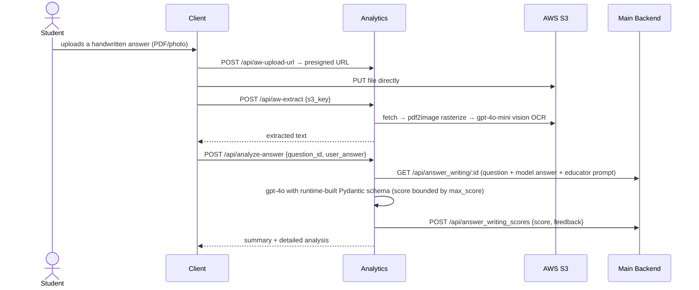

> Part of [[00 - Repo Documentation Overview]]

# Spaced Revision — Cross-Service Architecture

How the six core repos fit together: who owns what data, who calls whom, how identity propagates, and where the seams are. Per-repo internals live in the sibling notes — this one is the system view.

| Repo | Runtime | Port | Owns |
|------|---------|------|------|
| [[Backend - Main REST API]] `spaced-revision-sern-backend` | Node/Express (CommonJS) | 8080 | **MySQL — the system of record.** Users, courses, cards, MCQs, payments, credits, FCM |
| [[Web Frontend - React]] `spaced-revision-sern-frontend` | React 18 / Vite | 3000 | Web UI, Redux (classic thunks) |
| [[React Native App]] `react-native-app` | RN 0.79 / React 19 / TS | Metro 8081 | Mobile UI, **WatermelonDB offline store** |
| [[Chat Backend]] `spaced-revision-chat-backend` | Node/Express (ESM) + Socket.IO | 9000 | MongoDB: messages, reads, bug reports |
| [[AI Service - Content Generation]] `AI/` | Node/Express (ESM) | 8000 | MongoDB: AI answers + embeddings (answer cache) |
| [[Analytics - AI Evaluation and Chat]] `analytics/` | Python/FastAPI | 5000 | FAISS index, pgvector, MongoDB chat threads |

---

## 1. System map



### The one-line summary

> **The main backend owns all authoritative state. Every other service is stateless with respect to the user — it holds derived data (messages, AI answers, embeddings) and calls back into the backend for identity, entitlement and billing.**

That's why credits live in MySQL and both AI services read/write them over HTTP rather than keeping their own counters: there is exactly one place a balance can be wrong.

---

## 2. Identity & trust boundaries

Three different auth models coexist. Knowing which is which matters.



| Boundary | Mechanism | Strength |
|---|---|---|
| Client → Main backend | Real JWT in `x-auth-token`, `middleware/auth.js`; OAuth via passport (Google/Apple/Facebook) | ✅ Strong |
| Client → AI service | **No local verification.** It forwards your token upstream; a bad token dies at `/api/users/tokens` with 401/403 before any LLM spend | ✅ Adequate — auth is delegated, not skipped |
| Client → Analytics | Forwards `x-auth-token`; can also mint its own `HS256` token with the **shared `JWT_SECRET`**, shaped `{service, id, exp:+1h}` so Express's `req.user.id` destructuring works | ⚠️ Shared secret is the trust boundary |
| Client → Chat backend | **Trust-based.** The client asserts `{id, username, is_admin}` in the socket `auth` event; nothing is verified. `jsonwebtoken` is a declared dependency that no code imports | 🔴 Known gap |
| Chat → Main backend | `INTERNAL_SERVICE_KEY` (`middleware/requireInternalSecret.js`) | ✅ |
| IAP namespace | Shared `IAP_AUTHORIZATION_KEY` in the handshake header | ✅ |

The chat gap is the honest answer to "what would you fix first in this system": a client can currently claim `is_admin: true`. Mitigation is straightforward — verify the same JWT the rest of the platform uses, which is why `jsonwebtoken` and `JWT_SECRET` are already wired into the environment.

---

## 3. Service address maps

Neither client uses runtime env vars for service hosts — both hardcode them in a checked-in module, switched by build flag.

**Web** — `ecosystem.config.js` at the repo root:

```js
const live  = 'https://api.spacedrevision.com/api/';
const aws   = 'https://aws.spacedrevision.com/api/';
const dev   = 'https://dev.spacedrevision.com/api/';
const b     = 'http://localhost:8080/api/';
const ai    = 'https://ai.spacedrevision.com';        // AI service
const chat  = 'https://chat.spacedrevision.com';      // chat backend
const answerWritingProd = 'https://answerwriting.spacedrevision.in/api/';  // analytics
const transcoderSocketProd = 'https://logs.transcoder.spacedrevision.in';
```

> ⚠️ **Both branches of the `NODE_ENV === 'production'` check currently assign `address = b` (localhost:8080).** The prod constants `live`/`aws`/`dev` are defined but unreferenced — the file is hand-edited before a deploy rather than switched by environment. This is the #1 "why is prod pointing at localhost" trap in the web repo.

**React Native** — `src/shared/utils/constants.ts`, same pattern:

```ts
export const API_BASE_URL   = 'http://localhost:8080/api';        // toggled by comment
export const CHAT_SERVER    = 'https://chat.spacedrevision.com';
export const ANSWER_SERVER  = 'https://answerwriting.spacedrevision.in';
export const AI_SERVER      = '...';
export const API_UPLOAD_BASE_URL = 'https://api.spacedrevision.com/api';
export const APP_AUTH_ACCESS_KEY = '...';   // static shared key, in source
```

Both clients therefore talk to **four** backends directly. There is no API gateway or BFF — the browser/app fans out. Consequences: CORS must be configured per service (analytics hardcodes its origin list in `app.py`), and each service needs its own TLS host.

---

## 4. Data ownership



Every satellite store references MySQL rows by **bare integer id with no foreign key** — `responses.userId`, `responses.object_id`, chat `sender`/`recipient`, WatermelonDB `course_id`. Cross-store referential integrity is the application's problem, and the practical consequence is a recurring class of bug: **rows deleted or soft-deleted in MySQL leave orphans everywhere else.** (See the MCQ soft-delete read-filter work and the cloned-course video-mapping regression.)

The RN offline cache is the sharpest edge of this. `SyncManager` pulls catalog data into SQLite, and a `reconcileSoftDeletedCatalog` pass exists specifically because deletions don't arrive through normal sync — it's a one-shot repair guarded by an AsyncStorage flag.

---

## 5. End-to-end walkthroughs

### 5.1 "Ask AI about this MCQ"



Cost lever: identical questions across the whole student base collapse to one expensive call plus a cheap paraphrase. Correctness lever: an educator editing `educatorEditedAnswer` retroactively fixes every future cache hit.

### 5.2 SpaceyAI chat with content generation

```mermaid
sequenceDiagram
    actor S as Student
    participant CL as RN / Web
    participant AN as Analytics :5000
    participant AG as LangGraph ReAct agent
    participant FA as FAISS
    participant BE as Main Backend
    participant MG as Mongo

    S->>CL: "make me 5 flashcards on photosynthesis"
    CL->>AN: POST /api/chat {messages, model, course_id, thread_id, tokens} (NDJSON stream)
    AN->>AG: astream_events
    AG->>AG: get_course_structure — verify course/topic exists (anti-hallucination gate)
    AG->>FA: search_vector_db(topic) → note chunks
    AG->>AG: create_flashcards (gpt-4o, structured output)
    AG-->>AN: tool events + token deltas
    AN-->>CL: NDJSON: tokens, then structured flashcard payload
    CL->>CL: FlashcardView renders cards; prose never repeats them
    AN->>AN: aggregate_token_usage(agent + tool LLM calls)
    AN->>BE: POST /api/users/tokens (sync balance)
    AN->>MG: save_chat(interaction, thread_id)
```

Two subtleties that cost real money/quality if missed: tool-internal LLM calls must be summed into billing, and the structured payload must be rendered by the client rather than restated by the model.

### 5.3 Direct message with push fallback



**Push is centralised on purpose** — only the main backend holds FCM credentials; the chat service fires and forgets. Recipient `8234` is a magic id meaning "support": those DMs auto-create a `BugReport`, and prefixes `[Request a feature]` / `[Send us a message]` set its type.

### 5.4 Answer-writing evaluation



Large files never transit the API — presign, direct-to-S3, then process by key. The same 3-step pattern appears in the chat backend's file uploads.

---

## 6. Async & background work

All of it lives in the **main backend** (`notifications/`, `cron/`) on BullMQ over Redis:

| Queue / job | Trigger |
|---|---|
| `queue.js` + `worker.js` | Study reminders, scheduled per user |
| `overtakeQueue` | Peer-overtake nudges |
| `emiReminderQueue` + scheduler | Payment EMI reminders |
| `mcqAddedQueue` + scheduler | "New MCQs in your course" |
| `appVersionQueue` | Forced/soft update notices |
| `cron/eloUpdateCron.js` | `node-cron`, daily 03:00 IST — ELO ratings |

Dashboard at `/admin/queues` (Bull Board, gated by `BULL_BOARD_ACCESS_KEY`). The house rule is **event-driven over cron**: a "notify when X" feature becomes a queue + scheduler + worker with a Redis daily lock, not a `node-cron` entry — the ELO job is the standing exception because it's a genuine nightly batch recompute.

The AI services have **no** background workers. Long jobs (bulk answer analysis, `/practice/vectorize-all`, `/tag-mcqs/*`) run inline under `MAX_CONCURRENT_REQUESTS=20` with a 300s keep-alive — a real scaling limit worth naming.

---

## 7. Observability

| Layer | Tooling |
|---|---|
| Main backend | Prometheus `/metrics` (key-gated) · Winston → **Loki** · `/health` · Swagger `/api-docs` + ReDoc · Grafana dashboards checked in |
| Analytics | Per-request logging middleware · **LangSmith** tracing of every LLM/agent call (project `analytics-ai-service`) |
| AI service | `console.*` only |
| Chat backend | `console.*` + Socket.IO Admin UI |
| Clients | **PostHog** — project 2 is **RN-only**; the web app posts to its own project |

Uneven by design-drift rather than intent: the paths where money is spent (LLM calls) are traced in analytics but not in `AI/`.

---

## 8. Deployment shape

- Main backend, chat, AI, analytics: separate processes/containers, separate hostnames (`api.` / `chat.` / `ai.` / `answerwriting.`), no gateway in front.
- Docker Compose files exist for `AI/` and the chat backend; PM2 configs for both; the main backend runs under nodemon/PM2.
- Transcoder is the outlier: S3 event → SQS → poller → `docker run` FFmpeg (or ECS `run-task` in the documented-but-unused second mode) → Redis pub/sub → Socket.IO → browser, with a REST webhook back to the main backend for the final state.
- CI: RN has a `Jenkinsfile` + `ci_scripts/`; the web app runs ESLint at zero warnings with a husky pre-commit hook.
- **Package manager drift:** both clients have moved to **pnpm** (`--frozen-lockfile` in CI) while Volta config and older docs still say Yarn/npm. Install with pnpm.

---

## 9. Talking points for interviews

Things in this system that are actually interesting to explain, with the reasoning that makes them defensible:

1. **Semantic answer cache with a paraphrase layer** — cost collapse across a large student base, without two students seeing identical text, and with an educator-correction path that retroactively fixes every future hit.
2. **Delegated authentication** — satellite services never verify tokens themselves; they forward the user's token to the balance endpoint, so authn and entitlement resolve in a single upstream call and no service can drift out of sync on who a user is.
3. **Graceful degradation as a startup contract** — the analytics service boots with Mongo down, pgvector down, or both, and loses features rather than availability.
4. **Anti-hallucination via forced tool ordering** — requiring `get_course_structure` before any course/subject/topic name is used turns "model invents a plausible course" from a silent empty-result bug into an impossible state.
5. **Billing correctness in an agent loop** — tools make their own LLM calls, so usage must be aggregated across the agent *and* every tool invocation; and an empty completion (thinking model, `finish_reason: length`) must be neither billed nor cached, or it poisons the cache permanently.
6. **Offline-first mobile** — WatermelonDB/SQLite as the read path with a sync manager, plus an explicit reconciliation pass for soft deletes that normal sync can't express.
7. **The honest weaknesses** — trust-based socket auth, hardcoded service hosts in checked-in config (with a prod branch that currently points at localhost), no gateway, no cross-store referential integrity, long jobs running inline in FastAPI.
